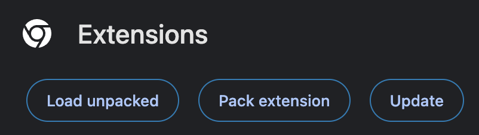

# Setup

Pre-requisites:

- Browser running the chromium engine: either Chrome or Edge
- `node`: >=18
- `pnpm`: To install follow the installation guide [here](https://pnpm.io/installation)

1. Run `pnpm install` in the root directory
2. Run `pnpm start:watch`. This should create a `dist/` directory with the code included and start watching all files in `src/`.
3. In your browser, visit your extensions
   - [Chrome](chrome://extensions/)
   - [Edge](edge://extensions/)
4. Turn on developer mode
5. Select `Load unpacked` button
   
6. Select the repo root directory directory (`VandyScheduler/`)
7. Enable the extension
8. Visit [https://more.app.vanderbilt.edu/more/SearchClasses!input.action](https://more.app.vanderbilt.edu/more/SearchClasses!input.action) to test.
